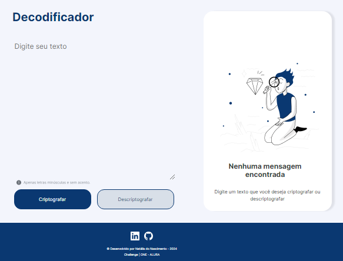

# Challenge ONE - ALURA

Desafio de programar um decodificador de texto usando HTML, CSS e JavaScript (não realizado ainda).

A proposta é permitir ao usuário inserir um texto na interface fornecida e visualizar o texto codificado.

# HTML e CSS

O processo começa com a criação de uma estrutura HTML que inclui elementos essenciais como caixas de entrada de texto e áreas de exibição. A estilização através do CSS visa não apenas garantir uma apresentação agradável e funcional, mas também assegurar a intuitividade do layout, facilitando a interação do usuário.

# JavaScript

Ainda não realizado.

